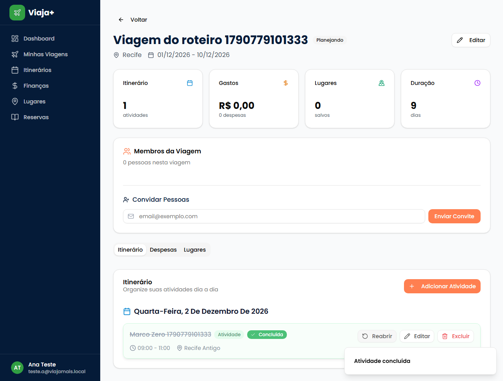
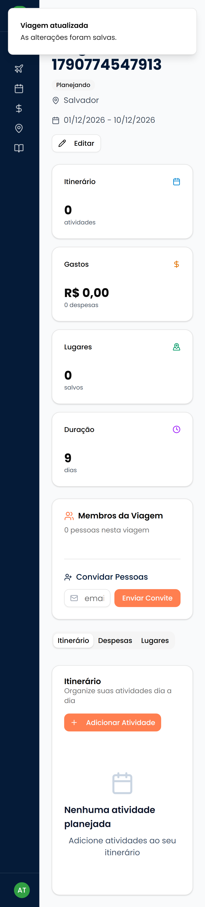

## 22. Implementação por Camadas do Sistema

Esta seção descreve como cada camada do ViajaMais foi efetivamente implementada, com referência aos arquivos do repositório e aos requisitos que cada parte atende.

### 22.1 Frontend

A interface foi desenvolvida em Next.js 16 com o App Router, sobre React 19. No App Router, cada rota corresponde a uma pasta dentro de `app/`, e o arquivo `page.tsx` da pasta define a tela; assim, a estrutura de diretórios é o próprio mapa de navegação do sistema. A estilização usa Tailwind CSS 4, e os componentes básicos (botões, cartões, campos, diálogos) vêm da biblioteca shadcn/ui, construída sobre os primitivos acessíveis do Radix e mantida sem alterações em `components/ui/`. Separamos a aplicação em duas áreas: a pública, com a página inicial e as telas de autenticação em `app/auth/`, e a autenticada, sob `app/dashboard/`. O acesso à área autenticada é barrado para visitantes sem sessão por `proxy.ts`, que redireciona para o login; um teste ponta a ponta de fumaça (`e2e/00-fumaca.spec.ts`) verifica esse bloqueio.

#### Organização das telas

Todas as telas da área autenticada compartilham o layout definido em `app/dashboard/layout.tsx`, que contém a barra lateral com os atalhos Dashboard, Minhas Viagens, Itinerários, Finanças, Lugares e Reservas, além do menu do usuário com Configurações e Sair. A tela central do sistema é o detalhe da viagem, que reúne indicadores, membros, convites e as abas Itinerário, Despesas e Lugares. A tabela a seguir relaciona cada tela ao tipo de componente adotado e aos requisitos do catálogo da seção 14 que ela atende.

| Tela (rota) | Tipo | Requisitos atendidos |
|---|---|---|
| `/auth/sign-up`, `/auth/sign-up-success` | Cliente | RF01.1, RF01.2 |
| `/auth/login` | Cliente | RF01.3 |
| `/auth/reset-password` | Cliente | RF01.7 |
| `/dashboard/settings` | Cliente | RF01.8, RF02.2, RF02.3 |
| `/dashboard` | Cliente | RF03.4 (visão geral das viagens) |
| `/dashboard/trips` | Cliente | RF03.4 |
| `/dashboard/trips/new` | Cliente | RF03.1 |
| `/dashboard/trips/[id]` | Servidor | RF03.5; RF04.1, RF04.3, RF04.7, RF04.8 (componentes de membros e convites); RF05.4 (aba Itinerário) |
| `/dashboard/trips/[id]/edit` | Cliente | RF03.2 |
| `/dashboard/trips/[id]/itinerary/new` | Cliente | RF05.1 |
| `/dashboard/trips/[id]/itinerary/[itemId]/edit` | Cliente | RF05.2 |
| `/dashboard/itinerary` | Servidor | RF05.4 |
| `/dashboard/trips/[id]/expenses/new` | Cliente | RF06.1 |
| `/dashboard/finances` | Servidor | RF06.4, RF06.5 |
| `/dashboard/bookings`, `/dashboard/trips/[id]/bookings/new` | Servidor / Cliente | RF07 |
| `/dashboard/places`, `/dashboard/trips/[id]/places` | Servidor / Cliente | RF08 |

As ações de concluir, reabrir e excluir atividade (RF05.2 e RF05.3) não têm tela própria: ficam no componente `components/itinerary-list.tsx`, exibido na aba Itinerário do detalhe da viagem.

#### Estrutura do código da interface

O código da interface está distribuído em cinco pastas. Em `app/` ficam as rotas e os layouts; em `components/` ficam os componentes interativos reutilizados entre telas, como `itinerary-list.tsx`, `trip-members.tsx`, `trip-invitations.tsx` e `place-autocomplete.tsx`, este último responsável pelo preenchimento automático de destino com o Google Places na criação de viagem; em `components/ui/` ficam os componentes de prateleira, com uma única exceção nossa, `confirm-modal.tsx`; em `context/` fica `auth-context.tsx`, que mantém no cliente a sessão do usuário e a lista de viagens; e em `hooks/` ficam os hooks compartilhados, entre eles `use-toast.ts`, usado para as mensagens de retorno ao usuário.

Adotamos a divisão entre Server Components e Client Components do React conforme a natureza da tela. As páginas de leitura agregada, como o detalhe da viagem, o itinerário geral, as finanças, os lugares e as reservas, são Server Components assíncronos: consultam o banco no servidor e entregam o HTML já preenchido, sem expor consultas ao navegador e sem uma etapa de carregamento no cliente. Formulários e telas com interação contínua, como login, cadastro, criação e edição de viagem e de atividade, despesa e configurações, são Client Components, marcados com a diretiva `"use client"`, porque dependem de estado local e de eventos do usuário. A visão geral (`/dashboard`) e a lista de viagens (`/dashboard/trips`) também são Client Components, pois leem a lista de viagens mantida em `auth-context.tsx`, que a obtém pela rota de API de viagens.

#### Comunicação com o backend e retorno ao usuário

A regra do projeto é que nenhuma escrita no banco parte do navegador. A tela envia a requisição por `fetch` a um route handler em `app/api/**`, que verifica a sessão, confirma a participação ou a propriedade da viagem por meio de `exigirMembro` e `exigirDono` (`lib/authz/trip.ts`) e valida o corpo com zod antes de gravar. Seguem esse padrão a edição de viagem (PATCH `/api/trips/[tripId]`), a criação e a listagem de viagens, a inclusão de atividade (POST `/api/trips/[tripId]/itinerary`), a edição, conclusão e exclusão de atividade (PATCH e DELETE `/api/trips/[tripId]/itinerary/[itemId]`), a inclusão de despesa, a gestão de membros e convites e as configurações de perfil e senha. Com isso, a autorização não depende do código que roda no cliente, que pode ser alterado por quem o executa.

Quando o servidor rejeita os dados, as telas de viagem e de itinerário exibem em um toast a mensagem de validação devolvida pela rota (campo `detalhes.fieldErrors` do zod), de modo que o usuário vê o mesmo motivo que o servidor aplicou. Ações destrutivas pedem confirmação no `ConfirmModal`, e não nas caixas `alert()` e `confirm()` do navegador, que não seguem a identidade visual e não podem ser testadas de forma uniforme.

No itinerário, entregue nesta fase, `itinerary-list.tsx` agrupa as atividades por data e oferece por item as ações Concluir ou Reabrir, Editar e Excluir. Enquanto a requisição de um item está em andamento, os botões desse item ficam desabilitados, o que impede envios duplicados. Após cada ação, `router.refresh()` solicita novamente os dados ao Server Component da página, evitando manter no cliente uma cópia paralela do estado que poderia divergir do banco.

*Figura 22.1 — Aba Itinerário do detalhe da viagem após a conclusão de uma atividade, capturada pelo teste `e2e/itinerario-crud.spec.ts` no perfil de computador.* A atividade concluída aparece com o título riscado, o cartão esmaecido e o selo "Concluída", enquanto as demais mantêm a aparência normal. Os botões Reabrir, Editar e Excluir permanecem visíveis no cartão, o que mostra que a conclusão é reversível e não remove o item.

#### Responsividade e verificação

A barra lateral passa a exibir apenas ícones abaixo do ponto de quebra `md` do Tailwind, e os cabeçalhos de página e os cartões são empilhados em telas estreitas. A verificação da interface é feita por testes ponta a ponta em Playwright, executados em dois perfis definidos em `playwright.config.ts`: `chromium`, que simula um navegador de computador, e `mobile`, que simula um Pixel 7. O perfil de celular já revelou um defeito real: a barra lateral sobrepunha o conteúdo e cobria o botão de salvar, o que levou à correção do layout do painel registrada na versão 2.6 da Parte 00.

*Figura 22.2 — Detalhe da viagem logo após a edição, capturado pelo teste `e2e/editar-viagem.spec.ts` no perfil `mobile`.* A imagem mostra a barra lateral reduzida aos ícones, o título, o status e o botão Editar empilhados na largura restante, sem rolagem lateral, e o aviso "Viagem atualizada" que confirma a gravação. Para chegar a essa tela, o teste precisou preencher e salvar o formulário de edição no mesmo perfil, etapa que antes da correção falhava porque o botão de salvar ficava encoberto.

#### Limitações conhecidas

Duas telas ainda não seguem o padrão de escrita pelo servidor. A tela de lugares da viagem (`app/dashboard/trips/[id]/places/page.tsx`) insere e exclui registros em `places` diretamente do navegador com o cliente Supabase, e a tela de nova reserva (`app/dashboard/trips/[id]/bookings/new/page.tsx`) insere em `bookings` da mesma forma. Nesses dois casos, a proteção depende apenas da RLS do banco, sem a verificação explícita de participação no servidor. Além disso, a tela de nova reserva existe, mas nenhum link da interface leva até ela, de modo que o usuário só a alcança digitando o endereço. A migração dessas telas para rotas de API e a inclusão do ponto de entrada de reservas estão previstas.
